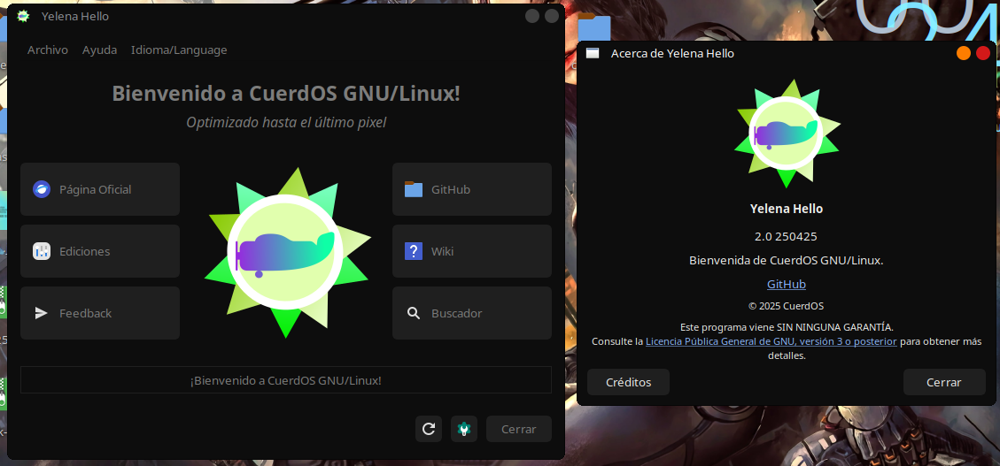

# Yelena Hello

<p align="center">
  
</p>
<p align="center">
  
</p>

**Yelena Hello** es un programa de bienvenida diseñado para la distribución **CuerdOS GNU/Linux**. Su propósito es proporcionar una experiencia de usuario amigable desde el primer momento, al iniciar el sistema operativo.

Este programa está potenciado por **Python**, lo que le otorga flexibilidad y rendimiento. Su interfaz está cuidadosamente diseñada utilizando **GTK** y **Qt**, dos de las bibliotecas gráficas más potentes para la creación de aplicaciones en entornos Linux.

Con **Yelena Hello**, los usuarios pueden disfrutar de una introducción interactiva a **CuerdOS**, facilitando la configuración inicial y ofreciendo información clave sobre el sistema operativo.

## Características

- **Soporte completo para GTK y Qt**, ofreciendo flexibilidad en la creación de interfaces gráficas de usuario.
- **Documentación detallada** sobre novedades, ediciones y más, para mantener al usuario informado sobre las actualizaciones y cambios importantes.
- **Ligero y sencillo**, ideal para usuarios principiantes que buscan una experiencia fácil de usar sin complicaciones.
- **Integración fluida** con el entorno de escritorio de **CuerdOS**, proporcionando una experiencia coherente y optimizada.
- **Parte esencial de CuerdOS Suite**, brindando herramientas y utilidades para mejorar la interacción con el sistema operativo.
- **Accesos directos** a diversas secciones del sistema y documentación, facilitando la navegación y el acceso a información clave de forma rápida y eficiente.

## Requisitos

- **CuerdOS GNU/Linux**
- **Python 3.x**
- **GTK 3.0**

## Instalación

Clona el repositorio y ejecuta la aplicación:

```bash
git clone https://github.com/gatoverde95/Yelena-Hello.git
cd Yelena-Hello
python3 hello2.py
```

## Uso

1. Ejecuta `python3 hello2.py`.
2. Navega por las opciones rapidas que proporciona.
3. Activa si quieres que se autoinicie.

## Configuración de inicio

El programa ya hace su respectiva configuración!!

## Contribuir

Si deseas colaborar en el desarrollo de **Yelena Hello**, síguenos en [GitHub](https://github.com/gatoverde95/Yelena-Hello) y envía tus **Pull Requests** o reporta errores en la sección de **Issues**.

## Licencia

Este proyecto está licenciado bajo la **GPLv3** y **CPLv1**. Puedes consultar el archivo `LICENSE` para más información.

---

> **Autor:** [gatoverde95](https://github.com/gatoverde95)  
> **Repositorio:** [Yelena Hello](https://github.com/gatoverde95/Yelena-Hello)
